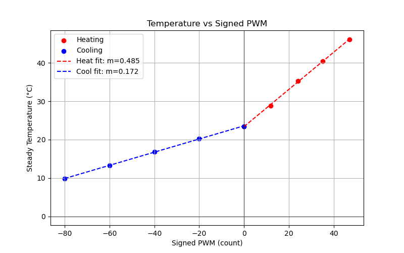

# Module 4: Open-Loop TEC Calibration and Software Safety

This project follows the [Phys 39 Module 4 assignment](https://sethfraden.github.io/Phys39F26-course/labs/lab-04/).
It builds on the Module 3 manual TEC controller. It adds a software temperature limit next to
the hardware thermal switch, measures the steady-state temperature at signed PWM values, and
compares the heating and cooling slopes with a TEC energy-balance model and the Laird data sheet.
It is open-loop control only; there is no feedback controller.

## Project Files

| File | Purpose |
| --- | --- |
| `arduino/module4_tec_control/module4_tec_control.ino` | Main sketch. Averages 1000 thermistor readings per temperature (about one line per second), accepts `SET PWM ... DIR ...` from Python, and shuts off both H-bridge PWM outputs above the 60 °C software limit. 9600 baud. |
| `arduino/module4_tec_control_limit30_test/module4_tec_control_limit30_test.ino` | Identical sketch with the limit lowered to 30 °C, used only to test the interlock by warming the thermistor by hand. |
| `python/module4_control_gui.py` | PySide6/pyqtgraph GUI: PWM slider, HEAT/COOL selector, live readouts, a temperature strip chart with an autoscaled y-axis, a red/blue PWM trace, a safety-shutdown banner, and a new CSV per run. |
| `python/steady_state_analysis.py` | Fits the time constant τ for each PWM step in a run CSV and applies the steady-state rule (≥ 3 τ, then one minute with drift no larger than the noise). |
| `python/part4_temp_vs_pwm.py` | Plots steady-state temperature vs signed PWM with a straight-line fit for each direction and prints m_h, m_c and r. |
| `data/module_04/part4_steady_state.csv` | Steady-state data: signed PWM, direction, start and steady temperature, time waited. |
| `docs/module_notes/module_04_high_current_path.md` | Module notes: wiring inspection, settings record, interlock test, start-up test, Part 3 method and table, Part 4 results, wiring fault, resolved items. |
| `docs/figures/module_04/` | High-current path diagram (`.svg`/`.png`) and the Part 4 graph. |

## Hardware

- **Board:** Arduino Uno. **H-bridge:** BTS7960. **TEC:** Laird CP14-127-045-L2-W4.5.
- **Supply:** 12 V, current limit 10 A. The heat exchanger (pump and fans) runs directly from the 12 V supply.
- **High-current path (18 AWG stranded copper):** supply V+/V− → H-bridge B+/B− → M+ → thermal switch → TEC+ … TEC− → M−. See the diagram in `docs/figures/module_04/`.
- **Thermistor:** 100 kΩ NTC (B = 4540 K) on A0 in a divider with a 100 kΩ resistor (resistor from 5 V to A0, thermistor from A0 to GND).
- **Direction (confirmed in the start-up test):** HEAT = PWM on pin 9 with pin 10 LOW; COOL = PWM on pin 10 with pin 9 LOW.

### Two independent protection levels

1. **Software limit, 60 °C:** every loop the sketch checks the latest averaged temperature. Above the limit, or with no valid reading, both H-bridge PWM outputs are set to 0 and new commands cannot turn them back on. When the temperature falls again, PWM stays at 0 until a new command is sent.
2. **Hardware thermal switch, about 70 °C:** a normally closed switch in series with the TEC opens and cuts TEC current, whatever the Arduino is doing.

## Serial Interface

Commands from Python (newline-terminated, PWM clamped to 0–255):

```text
SET PWM 120 DIR HEAT
SET PWM 45 DIR COOL
```

Measurement line, about once per second:

```text
Temperature (C): 27.73, Time (s): 645.06, PWM: 120, Direction input: 1, Active PWM pin: 9, Heat/Cool: 1, Safety shutdown: 0
```

The sketch also prints the active limit at start-up (`SAFETY: software temperature limit (C): 60.00`) and `SAFETY SHUTDOWN ACTIVE` / `SAFETY SHUTDOWN CLEARED` messages. The GUI echoes these lines to the terminal.

## How to Run

1. Install the Python dependencies: `python -m pip install pyserial PySide6 pyqtgraph numpy matplotlib`.
2. With TEC power off, upload `arduino/module4_tec_control/module4_tec_control.ino` to the Uno. The `.ino` file must stay in a folder of the same name.
3. Set `SERIAL_PORT` near the top of `python/module4_control_gui.py`. It is `COM5` on the lab computer.
4. Close the Arduino Serial Monitor and Serial Plotter. Only one program can open the port; otherwise Python reports "Access is denied".
5. From the repository root, run `python python/module4_control_gui.py`. Check that PWM starts at 0 and the temperature is plausible before enabling the supply.
6. To analyse a run, use `python python/steady_state_analysis.py data/module_04/module4_run_<date>_<time>.csv`. To make the Part 4 graph, use `python python/part4_temp_vs_pwm.py`.

## Results

| Part | Result |
| --- | --- |
| Interlock test | With a 30 °C test limit, warming the thermistor triggered `SAFETY SHUTDOWN ACTIVE` with both PWM outputs at 0. The 60 °C limit was then restored and shown to the instructor. |
| Part 2 endpoints | HEAT PWM 47 → 45.24 °C (target 45 ± 2 °C); COOL PWM 80 → 9.93 °C (target 10 ± 1 °C). |
| Part 2 PWM values | HEAT 0 / 12 / 24 / 35 / 47 and COOL 0 / 20 / 40 / 60 / 80, i.e. 0–100 % of each direction's maximum. |
| Steady state | Wait about 3 τ, then the temperature must stay within ±0.1 °C (about the normal noise) for one more minute. Waits were 370–725 s, so τ ≲ 100 s. |
| Part 4 slopes | m_h = 0.485 °C/count (0 to 47), m_c = 0.172 °C/count (−80 to 0), r = 2.82; no visible curvature. |
| Part 5 | Q̇_J/Q̇_P = (r − 1)/(r + 1) = 0.48. Laird data sheet at T_h = 27 °C: R_M = 1.50 Ω, I_max = 8.6 A, Q_c,max = 71.3 W, ΔT_max = 70.5 °C, giving r_Laird,max = 2.56. |



The Part 2 endpoint test and the Part 3/4 step series were done on different days. That shifts
the zero-PWM temperature, which moves the whole curve up or down, but not the slopes. Details are
in the module notes.

**Wiring fault:** during the cooling runs, loose L_EN and LPWM wires on the H-bridge made the
cooling drive intermittent. They were found with a wiggle test at low PWM, reseated, and the
affected measurements were repeated.

## AI Use Note

AI assistance (Claude Code) was used for the following:
- modifying the Module 3 sketch: 1000-reading averaging, the 60 °C software limit, and the safety reporting;
- adding the safety banner, the autoscaled temperature axis and per-run CSV files to the GUI;
- writing the steady-state analysis script;
- drawing the high-current path diagram, organizing the module notes and this README, and drafting parts of the A2 analysis.

The sketch was compiled for the Uno, and the safety logic was exercised in a host-side simulation.
All physical measurements, the interlock test, the wiring checks and the instructor checkoff were
done by the team in class.
