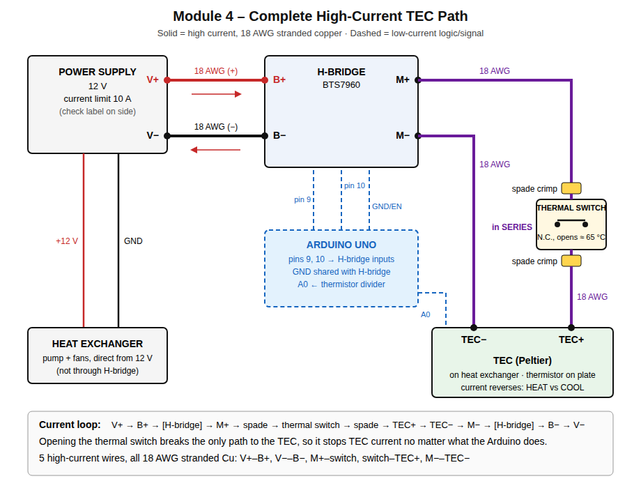

# Module 4 Part 1: High-Current Path (for instructor inspection)

Source: the Module 3 wiring record in `joshuaaferiat/Lab-Module-3`,
`docs/module_notes/module_03_tec_gui.md` (Part 1). **Before asking for approval,
re-check each item on the physical apparatus.** The actual wiring counts, not
this drawing.

## Diagram



Vector source: `docs/figures/module_04/high_current_path.svg`. Text version:

Solid lines (`│ ─`) carry high current: 18 AWG stranded copper.
Dotted lines (`┊ ┈`) are low-current logic wiring and are not part of the high-current path.

```
        ┌──────────────────────────────────────────┐
        │            POWER SUPPLY                  │
        │   Voltage: 12 V    Current limit: 10 A   │
        │        V+ (+)              V− (−)        │
        └─────────┬───────────────────┬────────────┘
                  │ 18 AWG            │ 18 AWG
                  │                   │
                  ├───────────────────┼──────────► Heat exchanger (pump + fans)
                  │                   │            powered directly from 12 V
                  │                   │            (NOT through H-bridge)
                  ▼                   ▼
        ┌─────── B+ ───────────────── B− ─────────┐
        │                                         │
        │        H-BRIDGE  (BTS7960)              │◄┈┈┈ Arduino pin 9  (PWM/LOW)
        │                                         │◄┈┈┈ Arduino pin 10 (PWM/LOW)
        │                                         │◄┈┈┈ Arduino GND (shared logic ground)
        └─────── M+ ───────────────── M− ─────────┘
                  │ 18 AWG            │ 18 AWG
                  │                   │
            ┌─────┴──────┐            │
            │  [spade]   │            │
            │  THERMAL   │  normally closed,
            │  SWITCH    │  in SERIES with TEC,
            │  (NC)      │  opens at ≈ 65 °C (Module 3 record)
            │  [spade]   │            │
            └─────┬──────┘            │
                  │ 18 AWG            │
                  ▼                   │
        ┌──────── TEC+ ─────────── TEC− ──────────┐
        │                  TEC                    │
        │      (thermistor plate / heat sink)     │
        └─────────────────────────────────────────┘

Current loop:
  PSU V+ → B+ → [H-bridge] → M+ → thermal switch → TEC+ → TEC → TEC− → M− → [H-bridge] → B− → PSU V−
  (In the other direction, current flows M− → TEC− → TEC → TEC+ → switch → M+.)
```

Opening the thermal switch breaks the M+ → TEC+ leg, so TEC current stops no
matter what the Arduino commands.

## Checklist for the instructor

| Item | Value / what to show | Verified today? |
| --- | --- | --- |
| Wire gauge | 18 AWG stranded Cu on all 5 high-current wires: V+→B+, V−→B−, M+→switch, switch→TEC+, TEC−→M− (the two switch wires end in the spade crimps) | ☐ |
| Supply polarity | V+ → B+, V− → B− | ☐ |
| TEC polarity | M+ → (switch) → TEC+; TEC− → M− | ☐ |
| Spade crimps | Both female spades on the thermal switch are secure (tug test) | ☐ |
| Thermal-switch continuity | Multimeter beeps / reads ≈ 0 Ω across the closed switch | ☐ |
| Thermal-switch placement | In series in the M+ → TEC+ leg, nothing bypasses it; mounted at: ________ | ☐ |
| Supply settings | 12 V, current limit 10 A (check the label on the side of the supply) | ☐ |
| H-bridge outputs checked with TEC power off (Module 3) | Pins 9/10 checked with the scope, TEC power off | ☐ |
| Logic ground | Arduino GND shared with H-bridge logic ground | ☐ |
| Direction mapping | Heating = PWM on pin ___ ; Cooling = PWM on pin ___ (see note 2) | ☐ |

## Module 4 changes from Module 3

| Item | Module 3 | Module 4 |
| --- | --- | --- |
| Thermistor divider external resistor (5 V to A0; thermistor from A0 to GND) | 100 kΩ | **48.00 kΩ** (`SERIES_RESISTOR = 48000.0`) |
| Raw readings averaged per temperature | 200 | 1000 (`ADC_SAMPLES`) |
| Serial update interval | 0.2 s | about 1 s (one line per 1000-reading average) |
| Software temperature limit | none | 60 °C (`TEMP_LIMIT_C`): above it, both H-bridge PWM outputs are set to 0 |
| Measurement line | ends at `Heat/Cool` | adds `, Safety shutdown: 0/1` |

## Files and settings for the module notes

| Item | Value |
| --- | --- |
| Arduino sketch | `arduino/module4_tec_control/module4_tec_control.ino` (9600 baud) |
| Python GUI | `python/module4_control_gui.py` |
| Serial port | ____ (the GUI is set to `COM5`; Module 3 used `COM4` / `/dev/cu.usbmodem1101`) |
| Power-supply voltage | ____ V (Module 3 record: 12 V) |
| Power-supply current limit | ____ A (Module 3 record: 10 A) |

## Verifying the software temperature limit (TEC power still OFF)

1. In the sketch, set `TEMP_LIMIT_C = 30.0` and upload. The GUI terminal shows
   `SAFETY: software temperature limit (C): 30.00`.
2. Set a nonzero PWM (for example 100) in the GUI so there is an output to shut off.
3. Warm the thermistor with your fingers until the averaged temperature passes 30 °C.
4. Confirm that the terminal prints `SAFETY SHUTDOWN ACTIVE ...`, the lines show `PWM: 0`
   and `Safety shutdown: 1`, the GUI banner turns red, and the PWM trace drops to 0.
   Optionally check that pins 9 and 10 both read 0 V.
5. Move the PWM slider: the Arduino keeps `PWM: 0` while the shutdown is active.
6. Let the thermistor cool below 30 °C: the terminal prints `SAFETY SHUTDOWN CLEARED ...`
   and PWM stays 0 until you send a new command.
7. Set `TEMP_LIMIT_C = 60.0`, upload again, and show the instructor the `60.00` start-up line.

## Things to resolve before sign-off

1. **Thermal-switch rating mismatch.** The Module 3 notes say the switch cuts off at
   **65 °C**. The Module 4 handout says it opens near **70 °C**. Read the rating
   stamped on the switch and write down the real value. Either way it is above the
   60 °C software limit, so the order of protection still holds: software limit
   (60 °C), then thermal switch.
2. **Direction mapping is inconsistent in Module 3.** The Module 3 notes and README
   say HEAT = PWM on **pin 10**, COOL = PWM on **pin 9**. But
   `arduino/tec_python_control/tec_python_control.ino` has
   `HEAT_ACTIVE_PIN = 9` and `COOL_ACTIVE_PIN = 10`. If the sketch is wrong, the GUI
   will label heating as cooling, so the red and blue PWM traces will be swapped.
   Settle this in the low-PWM heat/cool test after approval, and fix the constants.
3. **Baud rate.** The Module 3 README says 115200, but the sketch calls
   `Serial.begin(9600)`. The GUI uses 9600, so they match. The README is just out of date.
4. **Serial port.** Module 3 recorded `/dev/cu.usbmodem1101` (macOS) and `COM4`
   (Windows). The GUI is set to `COM5`. Use whichever port your computer shows today.
